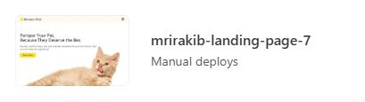

# Md. Rakibul Islam Rakib

**Email**: [mdrakibulislam11928@gmail.com](mailto:mdrakibulislam11928@gmail.com)  
**Phone**: [+8801955151970](tel:+8801955151970)

---

## 🚀 Objective

With a solid foundation in **web development** technologies like HTML, CSS, JavaScript, React, Node.js, and MongoDB, I’m eager to contribute to real-world projects in a collaborative environment. I’m looking for an opportunity where I can apply my skills, gain hands-on experience, and continue growing as a developer.

---

## 🛠️ Practicing

### **Frontend**

### **Backend**

### **Others**

### Version Control:

### Deployment:

### Design:

### **Current**

---

### 🧩 Fun-Fact

- To get the website preview working on Netlify, I deployed my project 8 times with some small changes. I knew that was not for any error - it was just for some unorganized or unnecessary code. After commenting out components one by one and redeploying after each change to find the issue. I found the issue: the imports in **App.jsx** were messy (like **Footer** on line 2, **Header** on line 5). Once I reorganized them properly and redeployed, the problem was fixed.

---

## 🎓 Education

**Secondary School Certificate (SSC)**  
_Language High School_ – Gazipur, Bangladesh  
**Passing Year**: 2025

---

## 🌍 Languages

- **English** (Advanced)
- **Bangla** (Native)

---

## 🔗 Social Contacts

- **Facebook**: [https://www.facebook.com/MRI.Rakib04](https://www.facebook.com/MRI.Rakib04)
- **Twitter/X**: [https://x.com/mrirakib04](https://x.com/mrirakib04)
- **Instagram**: [https://www.instagram.com/mrirakib04/](https://www.instagram.com/mrirakib04/)
- **LinkedIn**: [https://www.linkedin.com/in/mrirakib04/](https://www.linkedin.com/in/mrirakib04/)

---

### 5 September 12:45 AM
